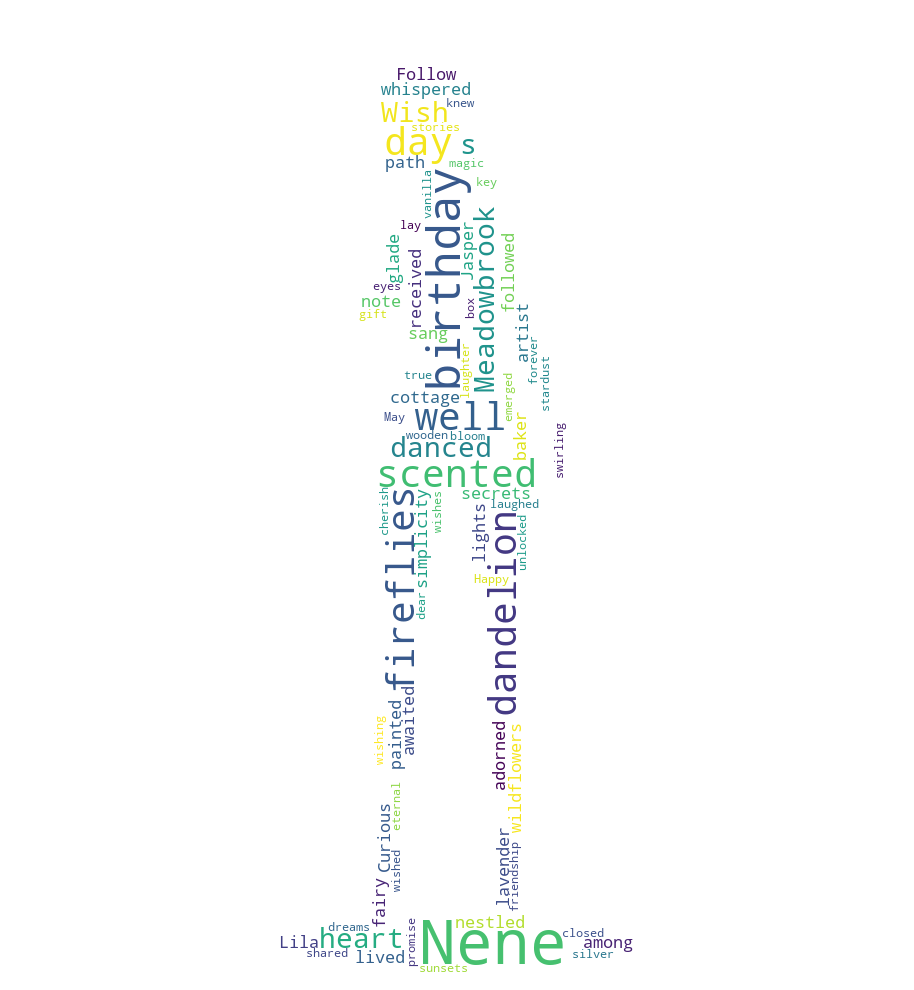

# Nene Word Cloud

This is an app that displays words in the form of characters created in the world cloud.

An image like the one below will be output.


## Install lib on Mac

```commandline
brew install --cask homebrew/cask-fonts/font-ipafont
```

## Install packages

```commandline
pip3 install -r requirements.txt
```

## Image preparation

Below is the original image.


Please create a mask file by blacking it out using Phtoshop etc.


## Run

```commandline
python3 main.py
```
